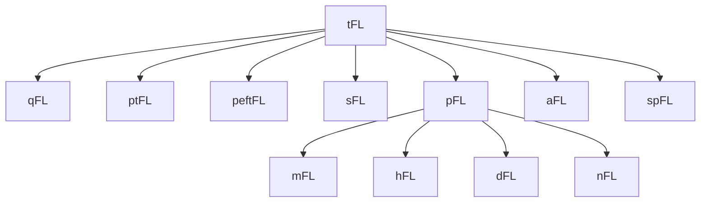

# Strategies

The category tree follows the reusable implementation bases; `tFL` is the root.

## nFL — No Federated Learning

Standalone baselines and non-FL pre-training methods. No model communication; each client trains independently or is evaluated in a centralized setting.

| Name | Venue | Year | Description | Paper | URL |
|------|-------|------|-------------|-------|-----|
| **LocalOnly** | | | Per-client local training only, no communication | | |
| **LocalOLS** | | | Per-client local OLS regression, no communication | | |
| **Centralized** | | | Oracle server model trained over every incumbent client's data with no FL communication | | |
| **SimTS†** | ICASSP | 2024 | Positive-only latent future prediction with stop-gradient, then frozen-encoder ridge forecasting | Simple Contrastive Representation Learning for Time Series Forecasting | [PUB](https://doi.org/10.1109/ICASSP48485.2024.10446875) - [Arxiv](https://arxiv.org/abs/2303.18205) - [GITHUB](https://github.com/xingyu617/SimTS_Representation_Learning) |
| **InfoTS†** | AAAI | 2023 | Information-aware binary-concrete augmentation selection with global/local contrastive pretraining and ridge forecasting | Time Series Contrastive Learning with Information-Aware Augmentations | [PUB](https://doi.org/10.1609/aaai.v37i4.25575) - [Arxiv](https://arxiv.org/abs/2303.11911) - [GITHUB](https://github.com/chengw07/InfoTS) |
| **SL** | NeurIPS | 2025 | Channel-wise selective MSE using residual-entropy uncertainty and DLinear residual-lower-bound anomaly masks | Selective Learning for Deep Time Series Forecasting | [PUB](https://doi.org/10.52202/085713-3277) - [NeurIPS](https://papers.neurips.cc/paper_files/paper/2025/hash/8cf54ff53f44835b9bdab2c546a1ca6d-Abstract-Conference.html) - [Arxiv](https://arxiv.org/abs/2510.25207) - [GITHUB](https://github.com/GestaltCogTeam/selective-learning) |

## tFL — Traditional Federated Learning

Central-server FL where a server aggregates client updates each round and broadcasts a single global model. All clients converge toward one shared solution.

| Name | Venue | Year | Description | Paper | URL |
|------|-------|------|-------------|-------|-----|
| **FedAvg** | AISTATS | 2017 | Weighted average of client model updates | Communication-Efficient Learning of Deep Networks from Decentralized Data | [Arxiv](https://arxiv.org/abs/1602.05629) |
| **FedProx** | MLSys | 2020 | Single shared model with a proximal local objective anchored to the downloaded global model | Federated Optimization in Heterogeneous Networks | [PUB](https://proceedings.mlsys.org/paper_files/paper/2020/hash/1f5fe83998a09396ebe6477d9475ba0c-Abstract.html) - [Arxiv](https://arxiv.org/abs/1812.06127) - [GITHUB](https://github.com/litian96/FedProx) |
| **FedAvgM** | NeurIPS FL Workshop | 2019 | FedAvg with server-side Polyak momentum on model updates | Measuring the Effects of Non-Identical Data Distribution for Federated Visual Classification | [PUB](https://research.google/pubs/measuring-the-effects-of-non-identical-data-distribution-for-federated-visual-classification/) - [Arxiv](https://arxiv.org/abs/1909.06335) - [REF](https://github.com/adap/flower/blob/main/src/py/flwr/server/strategy/fedavgm.py) |
| **SCAFFOLD** | ICML | 2020 | Variance-reduced FL via per-client control variates | SCAFFOLD: Stochastic Controlled Averaging for Federated Learning | [PUB](https://proceedings.mlr.press/v119/karimireddy20a.html) - [Arxiv](https://arxiv.org/abs/1910.06378) - [REF](https://github.com/TsingZ0/PFLlib/blob/master/system/flcore/servers/serverscaffold.py) |
| **FedNova** | NeurIPS | 2020 | Normalizes local updates by effective steps to fix objective inconsistency | Tackling the Objective Inconsistency Problem in Heterogeneous Federated Optimization | [PUB](https://proceedings.neurips.cc/paper/2020/hash/564127c03caab942e503ee6f810f54fd-Abstract.html) - [Arxiv](https://arxiv.org/abs/2007.07481) - [GITHUB](https://github.com/JYWa/FedNova) |
| **FedSPA** | IJCAI | 2021 | Client rand-k sparse noisy-gradient updates and sparse-delta upload; unweighted server adaptive update over u/v moments | Federated Learning with Sparsification-Amplified Privacy and Adaptive Optimization | [PUB](https://doi.org/10.24963/ijcai.2021/202) - [Arxiv](https://arxiv.org/abs/2008.01558) |
| **FedAdam** | ICLR | 2021 | Server-side Adam moments and uncorrected adaptive global update | Adaptive Federated Optimization | [PUB](https://openreview.net/forum?id=LkFG3lB13U5) - [Arxiv](https://arxiv.org/abs/2003.00295) - [GITHUB](https://github.com/google-research/federated/tree/master/optimization) - [REF](https://github.com/adap/flower/blob/main/src/py/flwr/server/strategy/fedadam.py) |
| **FedYogi** | ICLR | 2021 | Server-side Yogi sign-controlled second moment and uncorrected adaptive update | Adaptive Federated Optimization | [PUB](https://openreview.net/forum?id=LkFG3lB13U5) - [Arxiv](https://arxiv.org/abs/2003.00295) - [GITHUB](https://github.com/google-research/federated/tree/master/optimization) - [REF](https://github.com/adap/flower/blob/main/src/py/flwr/server/strategy/fedyogi.py) |
| **MOON†** | CVPR | 2021 | Model-contrastive regularization with global and previous local models | Model-Contrastive Federated Learning | [PUB](https://doi.org/10.1109/CVPR46437.2021.01057) - [Arxiv](https://arxiv.org/abs/2103.16257) - [GITHUB](https://github.com/QinbinLi/MOON) |
| **Caesar†** | arXiv | 2024 | Staleness-aware top-K+1-bit model download with client recovery; importance-ranked gradient upload sparsification | Caesar: A Low-deviation Compression Approach for Efficient Federated Learning | [Arxiv](https://arxiv.org/abs/2412.19989) |
| **FedADMM** | ICDE | 2022 | Persistent dual variables, augmented-model delta upload, and tracked global ADMM update | FedADMM: A Robust Federated Deep Learning Framework with Adaptivity to System Heterogeneity | [PUB](https://doi.org/10.1109/ICDE53745.2022.00238) - [Arxiv](https://arxiv.org/abs/2204.03529) - [GITHUB](https://github.com/YonghaiGong/FedADMM) - [REF](https://github.com/KarhouTam/FL-bench/blob/master/src/server/fedadmm.py) |
| **FedDyn** | ICLR | 2021 | Dynamic client-gradient state with a quadratic local anchor; the uniform active-model mean is corrected by the mean client state to produce one global model | Federated Learning Based on Dynamic Regularization | [PUB](https://openreview.net/forum?id=B7v4QMR6Z9w) - [Arxiv](https://arxiv.org/abs/2111.04263) - [GITHUB](https://github.com/alpemreacar/FedDyn) - [REF](https://github.com/TsingZ0/PFLlib/blob/master/system/flcore/servers/serverdyn.py) |
| **FedLAW** | ICML | 2023 | Proxy-data optimization of normalized client weights and a global shrinking factor | Revisiting Weighted Aggregation in Federated Learning with Neural Networks | [PUB](https://proceedings.mlr.press/v202/li23s.html) - [Arxiv](https://arxiv.org/abs/2302.10911) - [GITHUB](https://github.com/ZexiLee/ICML-2023-FedLAW) |
| **Elastic** | CVPR | 2023 | Element-wise elastic updates from unlabeled output-norm parameter sensitivity | Elastic Aggregation for Federated Optimization | [PUB](https://doi.org/10.1109/CVPR52729.2023.01173) - [OpenAccess](https://openaccess.thecvf.com/content/CVPR2023/html/Chen_Elastic_Aggregation_for_Federated_Optimization_CVPR_2023_paper.html) - [REF](https://github.com/KarhouTam/FL-bench/blob/master/src/server/elastic.py) |
| **FedCross** | ICDE | 2024 | Random dispatch and pairwise cross-aggregation of persistent middleware model slots | FedCross: Towards Accurate Federated Learning via Multi-Model Cross-Aggregation | [PUB](https://doi.org/10.1109/ICDE60146.2024.00170) - [Arxiv](https://arxiv.org/abs/2210.08285) - [REF](https://github.com/TsingZ0/PFLlib/blob/master/system/flcore/servers/servercross.py) |
| **FedRCL†** | CVPR | 2024 | Relaxed supervised contrastive loss with per-pair divergence penalty | Relaxed Contrastive Learning for Federated Learning | [PUB](https://doi.org/10.1109/CVPR52733.2024.01167) - [OpenAccess](https://openaccess.thecvf.com/content/CVPR2024/html/Seo_Relaxed_Contrastive_Learning_for_Federated_Learning_CVPR_2024_paper.html) - [Arxiv](https://arxiv.org/abs/2401.04928) - [GITHUB](https://github.com/skynbe/FedRCL) |
| **FedAWA** | CVPR | 2025 | Server optimization of persistent aggregation weights using client update vectors | FedAWA: Adaptive Optimization of Aggregation Weights in Federated Learning Using Client Vectors | [PUB](https://doi.org/10.1109/CVPR52734.2025.02854) - [OpenAccess](https://openaccess.thecvf.com/content/CVPR2025/html/Shi_FedAWA_Adaptive_Optimization_of_Aggregation_Weights_in_Federated_Learning_Using_CVPR_2025_paper.html) - [Arxiv](https://arxiv.org/abs/2503.15842) - [GITHUB](https://github.com/ChanglongShi/FedAWA) |
| **FedTrend** | Science China Information Sciences | 2026 | Client-trajectory synthetic data for local transfer plus global-trajectory data for server refinement | Tackling Data Heterogeneity in Federated Time Series Forecasting | [PUB](https://doi.org/10.1007/s11432-025-4553-x) - [Arxiv](https://arxiv.org/abs/2411.15716) |
| **FedRidge** | arXiv | 2026 | One-shot federated ridge regression via sufficient statistic aggregation | One-Shot Federated Ridge Regression: Exact Recovery via Sufficient Statistic Aggregation | [Arxiv](https://arxiv.org/abs/2601.08216) |
| **DLSA** | JCGS | 2021 | Federated weighted least-squares via precision-matrix aggregation | Least-Square Approximation for a Distributed System | [PUB](https://doi.org/10.1080/10618600.2021.1923517) - [Arxiv](https://arxiv.org/abs/1908.04904) |
| **DeComFL‡** | ICLR | 2025 | Zeroth-order optimization: clients upload only scalar loss-difference gradients (dimension-free uplink); server reconstructs the update from shared perturbation seeds | Achieving Dimension-Free Communication in Federated Learning via Zeroth-Order Optimization | [PUB](https://openreview.net/forum?id=omrLHFzC37) - [Arxiv](https://arxiv.org/abs/2405.15861) - [GITHUB](https://github.com/ZidongLiu/DeComFL) |
| **FedLUAR** | NeurIPS | 2025 | Recycles previous-round updates for a subset of layers, chosen via inverse-magnitude probability sampling, to cut uplink | Layer-wise Update Aggregation with Recycling for Communication-Efficient Federated Learning | [PUB](https://proceedings.neurips.cc/paper_files/paper/2025/hash/7ccae68f81c1bd9104c304a9d8967048-Abstract-Conference.html) - [OpenReview](https://openreview.net/forum?id=t6EPMcudln) - [Arxiv](https://arxiv.org/abs/2503.11146) - [GITHUB](https://github.com/swblaster/FedLUAR) |

## qFL — Quantized Federated Learning

The quantization branch of `tFL`. Both implementations quantize one whole client update and apply its unweighted mean at the server; their quantizers remain strategy-specific static methods.

| Name | Venue | Year | Description | Paper | URL |
|------|-------|------|-------------|-------|-----|
| **FedPAQ** | AISTATS | 2020 | Unweighted periodic averaging with stochastic whole-update-vector quantization | FedPAQ: A Communication-Efficient Federated Learning Method with Periodic Averaging and Quantization | [PUB](https://proceedings.mlr.press/v108/reisizadeh20a.html) - [Arxiv](https://arxiv.org/abs/1909.13014) |
| **QATFL** | IEEE TMLCN | 2026 | Affine fake-quantization + STE during local training; affine-quantized whole-delta upload | Communication Efficient Federated Learning With Quantization-Aware Training Design | [PUB](https://doi.org/10.1109/TMLCN.2025.3635050) |

## ptFL — Partial-Training Federated Learning

Model-heterogeneous FL where the server owns a full model but each client
trains and communicates only a capacity-matched physical submodel. The server
retains each extraction manifest and selectively aggregates only the exact
global coordinates trained by participating clients.

| Name | Venue | Year | Description | Paper | URL |
|------|-------|------|-------------|-------|-----|
| **FedDropout** | arXiv | 2018 | Fresh random fixed-width physical submodels reduce client compute and communication | Expanding the Reach of Federated Learning by Reducing Client Resource Requirements | [Arxiv](https://arxiv.org/abs/1812.07210) - [GitHub](https://github.com/AIoT-MLSys-Lab/FedRolex) |
| **FedRolex** | NeurIPS | 2022 | Unit-stride rolling physical submodels with selective per-coordinate averaging | FedRolex: Model-Heterogeneous Federated Learning with Rolling Sub-Model Extraction | [Arxiv](https://arxiv.org/abs/2212.01548) - [GitHub](https://github.com/AIoT-MLSys-Lab/FedRolex) |

## peftFL — Parameter-Efficient Federated Learning

The parameter-efficient branch of `tFL`. The shared base installs LoRA adapters, restricts training and payloads to the selected factors, and keeps reusable workers logically stateless. `FedSA_LoRA` also inherits `pFL` because its LoRA-B factors are client-owned state persisted by the server.

| Name | Venue | Year | Description | Paper | URL |
|------|-------|------|-------------|-------|-----|
| **FedIT†** | ICASSP | 2024 | Trains both LoRA factors and sample-weight averages only those adapters | Towards Building the Federated GPT: Federated Instruction Tuning | [PUB](https://sigport.org/documents/towards-building-federated-gpt-federated-instruction-tuning) - [Arxiv](https://arxiv.org/abs/2305.05644) - [GITHUB](https://github.com/JayZhang42/FederatedGPT-Shepherd) |
| **FFA_LoRA†** | ICLR | 2024 | Freezes the shared random LoRA-A initialization and trains and aggregates only LoRA-B | Improving LoRA in Privacy-preserving Federated Learning | [PUB](https://openreview.net/forum?id=NLPzL6HWNl) - [Arxiv](https://arxiv.org/abs/2403.12313) |
| **FedSA_LoRA†** | ICLR | 2025 | Trains both factors, aggregates shared LoRA-A, and retains each client's LoRA-B on the server | Selective Aggregation for Low-Rank Adaptation in Federated Learning | [PUB](https://openreview.net/forum?id=iX3uESGdsO) - [Arxiv](https://arxiv.org/abs/2410.01463) - [GITHUB](https://github.com/Pengxin-Guo/FedSA-LoRA) |
| **LoRA_FAIR†** | ICCV | 2025 | Sample-weight averages both factors, then optimizes a LoRA-B residual to align the factorized and averaged full updates | LoRA-FAIR: Federated LoRA Fine-Tuning with Aggregation and Initialization Refinement | [PUB](https://openaccess.thecvf.com/content/ICCV2025/html/Bian_LoRA-FAIR_Federated_LoRA_Fine-Tuning_with_Aggregation_and_Initialization_Refinement_ICCV_2025_paper.html) - [Arxiv](https://arxiv.org/abs/2411.14961) - [GITHUB](https://github.com/jmbian/LoRA-FAIR) |
| **FlexLoRA†** | NeurIPS | 2024 | Sample-weight averages clients' scaled full LoRA updates, then redistributes rank-specific SVD factors | Federated Fine-tuning of Large Language Models under Heterogeneous Tasks and Client Resources | [PUB](https://proceedings.neurips.cc/paper_files/paper/2024/hash/1a134b50202088aa8c595cc99b310e5a-Abstract-Conference.html) - [Arxiv](https://arxiv.org/abs/2402.11505) - [GITHUB](https://github.com/alibaba/FederatedScope/tree/FlexLoRA) |

## sFL — Security-Aware Federated Learning

Central-server FL with a pluggable threat injection seam between client training and aggregation. Strategies that inherit from `sFL` get the seam for free and can be evaluated under any registered attack (Byzantine model poisoning, sign-flip, etc.) by flipping `--attack` at run time without changing strategy code.

Strategies that inherit from `sFL` implement a specific defense; more families can be added without touching the injection seam.

Use `--attack <name>` and `--malicious_frac <f>` to switch between benign and adversarial evaluation — see [Usage § Adversarial Eval](usage.md#adversarial-eval).

| Name | Venue | Year | Description | Paper | URL |
|------|-------|------|-------------|-------|-----|
| **Krum†** | NeurIPS | 2017 | Unweighted Krum/Multi-Krum selection over client model uploads with paper-valid neighbor counts | Machine Learning with Adversaries: Byzantine Tolerant Gradient Descent | [PUB](https://proceedings.neurips.cc/paper/2017/hash/f4b9ec30ad9f68f89b29639786cb62ef-Abstract.html) - [Arxiv](https://arxiv.org/abs/1703.02757) - [REF](https://github.com/adap/flower/blob/main/framework/py/flwr/server/strategy/krum.py) |
| **FedMedian†** | ICML | 2018 | Unweighted usual coordinate-wise median of client model uploads | Byzantine-Robust Distributed Learning: Towards Optimal Statistical Rates | [PUB](https://proceedings.mlr.press/v80/yin18a.html) - [Arxiv](https://arxiv.org/abs/1803.01498) - [REF](https://github.com/adap/flower/blob/main/framework/py/flwr/server/strategy/fedmedian.py) |
| **FedTrimmedAvg†** | ICML | 2018 | Unweighted coordinate-wise beta-trimmed mean of client model uploads | Byzantine-Robust Distributed Learning: Towards Optimal Statistical Rates | [PUB](https://proceedings.mlr.press/v80/yin18a.html) - [Arxiv](https://arxiv.org/abs/1803.01498) - [REF](https://github.com/adap/flower/blob/main/framework/py/flwr/server/strategy/fedtrimmedavg.py) |

## pFL — Personalized Federated Learning

Personalized FL produces a client-specific model through persistent local state, client-specific aggregation, or adaptation of a learned shared initialization. A method need not retain a single deployable global model (FedAMP does not).

FedProC uses stateless workers, so the server persists and transports logical client-local state in each selected client's package. The update equations and per-client ownership remain the same. Measured communication includes that state unless a strategy's `__wire__` contract narrows accounting to the paper's stated payload.

| Name | Venue | Year | Description | Paper | URL |
|------|-------|------|-------------|-------|-----|
| **Ditto** | ICML | 2021 | Persistent personalized model optimized with a proximal anchor to the global model; only the independent global update is aggregated | Ditto: Fair and Robust Federated Learning Through Personalization | [PUB](https://proceedings.mlr.press/v139/li21h.html) - [Arxiv](https://arxiv.org/abs/2012.04221) - [GITHUB](https://github.com/litian96/ditto) - [REF](https://github.com/TsingZ0/PFLlib/blob/master/system/flcore/servers/serverditto.py) |
| **pFedMe** | NeurIPS | 2020 | K inner proximal steps and an ηλ outer update per fresh mini-batch, followed by uniform averaging and the paper's β server blend | Personalized Federated Learning with Moreau Envelopes | [PUB](https://proceedings.neurips.cc/paper_files/paper/2020/hash/f4f1f13c8289ac1b1ee0ff176b56fc60-Abstract.html) - [Arxiv](https://arxiv.org/abs/2006.08848) - [GITHUB](https://github.com/CharlieDinh/pFedMe) - [REF](https://github.com/TsingZ0/PFLlib/blob/master/system/flcore/servers/serverpFedMe.py) |
| **APFL** | arXiv | 2020 | Local descent at the parameter mixture αv+(1−α)w with one adaptive-α update per round and uniform global-model averaging | Adaptive Personalized Federated Learning | [Arxiv](https://arxiv.org/abs/2003.13461) - [GITHUB](https://github.com/MLOPTPSU/FedTorch) - [REF](https://github.com/TsingZ0/PFLlib/blob/master/system/flcore/servers/serverapfl.py) |
| **PFMCP** | Expert Systems with Applications | 2026 | Post-FedAvg local decoder and input-dependent global/local MoE gate, followed by client-local dynamically updated conformal intervals | Personalized Federated Learning with Mixture of Experts and Conformal Prediction for Household Energy Forecasting | [PUB](https://doi.org/10.1016/j.eswa.2025.130417) |
| **FedAMP** | AAAI | 2021 | Maintains one personalized client/cloud model per client and uses the paper's distance-derived convex attention followed by proximal local training | Personalized Cross-Silo Federated Learning on Non-IID Data | [PUB](https://doi.org/10.1609/aaai.v35i9.16960) - [Arxiv](https://arxiv.org/abs/2007.03797) - [REF](https://github.com/TsingZ0/PFLlib/blob/master/system/flcore/servers/serveramp.py) |
| **FedBN** | ICLR | 2021 | Keeps every batch-normalization parameter and running-statistic buffer local while uniformly averaging all non-BN model state | FedBN: Federated Learning on Non-IID Features via Local Batch Normalization | [PUB](https://openreview.net/forum?id=6YEQUn0QICG) - [Arxiv](https://arxiv.org/abs/2102.07623) - [GITHUB](https://github.com/med-air/FedBN) - [REF](https://github.com/TsingZ0/PFLlib/blob/master/system/flcore/servers/serverbn.py) |
| **FML†** | Frontiers of Information Technology & Electronic Engineering | 2023 | Resets each forked meme model/optimizer from the global state, performs detached-target bidirectional KL learning, and uniformly merges every client meme model | Federated mutual learning: a collaborative machine learning method for heterogeneous data, models, and objectives | [PUB](https://doi.org/10.1631/FITEE.2300098) - [Arxiv](https://arxiv.org/abs/2006.16765) - [GITHUB](https://github.com/ZJU-DAI/Federated-Mutual-Learning) - [REF](https://github.com/TsingZ0/PFLlib/blob/master/system/flcore/clients/clientfml.py) |
| **CFL** | IEEE TNNLS | 2021 | Recursively complete-linkage clusters all clients by update cosine similarity, then performs sample-weighted FedAvg within each cluster | Clustered Federated Learning: Model-Agnostic Distributed Multi-Task Optimization under Privacy Constraints | [PUB](https://doi.org/10.1109/TNNLS.2020.3015958) - [Arxiv](https://arxiv.org/abs/1910.01991) - [GITHUB](https://github.com/felisat/clustered-federated-learning) - [REF](https://github.com/KarhouTam/FL-bench/blob/master/src/server/cfl.py) |
| **LGFedAvg** | NeurIPS FL Workshop | 2019 | Trains a persistent client-local encoder and sample-weighted shared suffix predictor end-to-end; only the shared suffix is communicated | Think Locally, Act Globally: Federated Learning with Local and Global Representations | [Arxiv](https://arxiv.org/abs/2001.01523) - [GITHUB](https://github.com/pliang279/LG-FedAvg) - [REF](https://github.com/KarhouTam/FL-bench/blob/master/src/server/lgfedavg.py) |
| **pFedHN** | ICML | 2021 | A server-only hypernetwork emits one full personalized model to one sampled client, which returns only its initial-minus-trained update | Personalized Federated Learning using Hypernetworks | [PUB](https://proceedings.mlr.press/v139/shamsian21a.html) - [Arxiv](https://arxiv.org/abs/2103.04628) - [GITHUB](https://github.com/AvivSham/pFedHN) |
| **pFedLA** | CVPR | 2022 | Dedicated per-client hypernetworks learn block-wise weights over incumbent client models; HeurpFedLA retains the top-K self-weighted blocks locally | Layer-Wised Model Aggregation for Personalized Federated Learning | [PUB](https://openaccess.thecvf.com/content/CVPR2022/html/Ma_Layer-Wised_Model_Aggregation_for_Personalized_Federated_Learning_CVPR_2022_paper.html) - [Arxiv](https://arxiv.org/abs/2205.03993) - [REF](https://github.com/KarhouTam/pFedLA) |
| **FedFew†** | CVPR | 2026 | Full-participation STCH-Set jointly updates three server models from every client's model-wise losses and gradients, then deploys each client's minimum-loss model | Few-for-Many Personalized Federated Learning | [OpenAccess](https://openaccess.thecvf.com/content/CVPR2026/html/Guo_Few-for-Many_Personalized_Federated_Learning_CVPR_2026_paper.html) - [Arxiv](https://arxiv.org/abs/2603.11992) - [GITHUB](https://github.com/pgg3/FedFew) |
| **FedALA** | AAAI | 2023 | Preserves lower local layers and learns element-wise old-local/global mixing weights for upper-layer initialization before local training | FedALA: Adaptive Local Aggregation for Personalized Federated Learning | [PUB](https://doi.org/10.1609/aaai.v37i9.26330) - [Arxiv](https://arxiv.org/abs/2212.01197) - [GITHUB](https://github.com/TsingZ0/FedALA) |
| **FedCAC** | ICCV | 2023 | Top-τ sensitivity masks drive full-client uniform global averaging and overlap-thresholded customized collaboration | Bold but Cautious: Unlocking the Potential of Personalized Federated Learning through Cautiously Aggressive Collaboration | [OpenAccess](https://openaccess.thecvf.com/content/ICCV2023/html/Wu_Bold_but_Cautious_Unlocking_the_Potential_of_Personalized_Federated_Learning_ICCV_2023_paper.html) - [Arxiv](https://arxiv.org/abs/2309.11103) - [REF](https://github.com/TsingZ0/PFLlib/blob/master/system/flcore/servers/servercac.py) |
| **FedSelect†** | CVPR | 2024 | Alternates personalized/global local updates, grows per-weight masks, and averages each remaining global coordinate over its participating clients | FedSelect: Personalized Federated Learning with Customized Selection of Parameters for Fine-Tuning | [PUB](https://openaccess.thecvf.com/content/CVPR2024/html/Tamirisa_FedSelect_Personalized_Federated_Learning_with_Customized_Selection_of_Parameters_for_CVPR_2024_paper.html) - [Arxiv](https://arxiv.org/abs/2404.02478) - [GITHUB](https://github.com/lapisrocks/fedselect) |

## mFL — Meta-Learning Personalized Federated Learning

The meta-learning branch of `pFL`. The server learns a shared initialization, and each client or unseen task personalizes it with local adaptation.

| Name | Venue | Year | Description | Paper | URL |
|------|-------|------|-------------|-------|-----|
| **PerAvg** | NeurIPS | 2020 | Uniformly averages a shared meta-initialization trained with independent inner/meta mini-batches, then personalizes it by one local gradient step at evaluation | Personalized Federated Learning with Theoretical Guarantees: A Model-Agnostic Meta-Learning Approach | [PUB](https://proceedings.neurips.cc/paper/2020/hash/24389bfe4fe2eba8bf9aa9203a44cdad-Abstract.html) - [Arxiv](https://arxiv.org/abs/2002.07948) - [REF](https://github.com/TsingZ0/PFLlib/blob/master/system/flcore/servers/serverperavg.py) |
| **AirMetapFL†** | IEEE TCCN | 2026 | Error-feedback sparsification and partial-DFT over-the-air aggregation train a MAML initialization for one-step personalization to new tasks | Pre-Training and Personalized Fine-Tuning via Over-the-Air Federated Meta-Learning: Convergence-Generalization Trade-Offs | [PUB](https://doi.org/10.1109/TCCN.2025.3640114) - [Arxiv](https://arxiv.org/abs/2406.11569) |

## hFL — Heterogeneous Federated Learning

Clients have architecturally different models. Knowledge is transferred via a shared public dataset or distillation rather than direct parameter averaging.

| Name | Venue | Year | Description | Paper | URL |
|------|-------|------|-------------|-------|-----|
| **FedMD†** | NeurIPS FL Workshop | 2019 | All clients average raw predictions on shared public batches, then alternate public-consensus digestion and private-data revisiting | FedMD: Heterogenous Federated Learning via Model Distillation | [PUB](https://neurips.cc/virtual/2019/15377) - [Arxiv](https://arxiv.org/abs/1910.03581) - [REF](https://github.com/Tzq2doc/FedMD) |
| **FedDF†** | NeurIPS | 2020 | Sample-weight initializes each architecture prototype, then server-side average-output distillation transfers knowledge from every selected model | Ensemble Distillation for Robust Model Fusion in Federated Learning | [PUB](https://proceedings.neurips.cc/paper/2020/hash/18df51b97ccd68128e994804f3eccc87-Abstract.html) - [Arxiv](https://arxiv.org/abs/2006.07242) - [GITHUB](https://github.com/epfml/federated-learning-public-code) |

## dFL — Decentralized Federated Learning

Clients communicate directly with neighbors and aggregate only their local neighborhood. FedProC's server process simulates the peer network and owns each logical node's state so workers remain reusable; internal worker transport is excluded and topology-scaled peer model exchanges are counted.

| Name | Venue | Year | Description | Paper | URL |
|------|-------|------|-------------|-------|-----|
| **DFedAvg** | IEEE TPAMI | 2023 | Multiple local SGD steps followed by simultaneous weighted neighbor mixing | Decentralized Federated Averaging | [PUB](https://doi.org/10.1109/TPAMI.2022.3196503) - [Arxiv](https://arxiv.org/abs/2104.11375) |
| **DFedProx§** | MLSys | 2020 | DFedAvg neighbor mixing with the FedProx local proximal objective | Federated Optimization in Heterogeneous Networks | [PUB](https://proceedings.mlsys.org/paper_files/paper/2020/hash/1f5fe83998a09396ebe6477d9475ba0c-Abstract.html) - [Arxiv](https://arxiv.org/abs/1812.06127) - [GITHUB](https://github.com/litian96/FedProx) |
| **DFedSAM** | ICML | 2023 | Local SAM perturbation followed by one gossip step, or the paper's configurable Q-step MGS variant | Improving the Model Consistency of Decentralized Federated Learning | [PUB](https://proceedings.mlr.press/v202/shi23d.html) - [Arxiv](https://arxiv.org/abs/2302.04083) |
| **DFedAWA§** | CVPR | 2025 | Each node optimizes FedAWA Eq. 3 over its own received neighborhood models | FedAWA: Adaptive Optimization of Aggregation Weights in Federated Learning Using Client Vectors | [OpenAccess](https://openaccess.thecvf.com/content/CVPR2025/html/Shi_FedAWA_Adaptive_Optimization_of_Aggregation_Weights_in_Federated_Learning_Using_CVPR_2025_paper.html) - [Arxiv](https://arxiv.org/abs/2503.15842) - [GITHUB](https://github.com/ChanglongShi/FedAWA) |
| **DFedHPO** | Internet of Things | 2025 | One pre-training local search pass, one neighbor exchange, then CA/FA/MA aggregation per logical node | Consensus-Driven Hyperparameter Optimization for Accelerated Model Convergence in Decentralized Federated Learning | [PUB](https://doi.org/10.1016/j.iot.2024.101476) |

## aFL — Asynchronous Federated Learning

No synchronization barrier; clients run continuously and results are aggregated as they arrive. A server-side buffer collects K results before each aggregation step, decoupling client speed from global update frequency.

| Name | Venue | Year | Description | Paper | URL |
|------|-------|------|-------------|-------|-----|
| **FedPSA** | Expert Systems with Applications | 2026 | Paper-default sensitivity sketch (`k=16`) + momentum thermometer (`Lq=50`) + softmax aggregation over a five-update async buffer | FedPSA: Modeling Behavioral Staleness in Asynchronous Federated Learning | [PUB](https://doi.org/10.1016/j.eswa.2026.133003) - [Arxiv](https://arxiv.org/abs/2602.15337) |

---

## spFL - Sparse/Pruning Federated Learning

Dynamic sparse training in FL: clients maintain a binary mask that zeroes selected weights each round. A cosine-decay schedule (`delta_T` adjustment rounds up to `T_end`) controls how aggressively the mask evolves.

FedProC keeps dense PyTorch tensors behind boolean masks. The topology equations are implemented, but this generic representation does not reproduce the papers' sparse-kernel compute savings or compressed tensor transport.

| Name | Venue | Year | Description | Paper | URL |
|------|-------|------|-------------|-------|-----|
| **PruneFL†** | TNNLS | 2022 | Protected high-magnitude core plus greedy squared-gradient/round-time architecture search | Model Pruning Enables Efficient Federated Learning on Edge Devices | [PUB](https://doi.org/10.1109/TNNLS.2022.3166101) - [Arxiv](https://arxiv.org/abs/1909.12326) - [GITHUB](https://github.com/jiangyuang/PruneFL) - [REF](https://github.com/FedPruning/FedPruning/tree/main/api/distributed/prunefl) |
| **FedDST** | AAAI | 2022 | Client magnitude-prune/gradient-grow followed by coordinate-wise sparse weighted averaging and server magnitude re-pruning | Federated Dynamic Sparse Training: Computing Less, Communicating Less, Yet Learning Better | [PUB](https://doi.org/10.1609/aaai.v36i6.20555) - [Arxiv](https://arxiv.org/abs/2112.09824) - [GITHUB](https://github.com/bibikar/feddst) - [REF](https://github.com/FedPruning/FedPruning/tree/main/api/distributed/feddst) |
| **FedTiny†** | ICDCS | 2023 | Output-to-input progressive block updates using client top-k inactive gradients and server magnitude prune/grow | Distributed Pruning Towards Tiny Neural Networks in Federated Learning | [PUB](https://doi.org/10.1109/ICDCS57875.2023.00036) - [Arxiv](https://arxiv.org/abs/2212.01977) - [REF](https://github.com/FedPruning/FedPruning/tree/main/api/distributed/fedtinyclean) |
| **FedMef†** | CVPR | 2024 | Squared-L2 budget-aware extrusion with the REX learning-rate floor, top-k gradient growth, and magnitude pruning | FedMef: Towards Memory-efficient Federated Dynamic Pruning | [PUB](https://openaccess.thecvf.com/content/CVPR2024/html/Huang_FedMef_Towards_Memory-efficient_Federated_Dynamic_Pruning_CVPR_2024_paper.html) - [Arxiv](https://arxiv.org/abs/2403.14737) - [REF](https://github.com/FedPruning/FedPruning/tree/main/api/distributed/fedmef) |
| **FedSGC†** | ICLR PML Workshop | 2024 | Congruity-prioritized local prune/grow, sparse residual aggregation for nonparticipants, global repruning, and direction-map feedback | Gradient-Congruity Guided Federated Sparse Training | [PUB](https://iclr.cc/virtual/2024/20633) - [OpenReview](https://openreview.net/forum?id=KHDncjMdjJ) - [Arxiv](https://arxiv.org/abs/2405.01189) - [REF](https://github.com/FedPruning/FedPruning/tree/main/api/distributed/fedsgc) |
| **FedRTS** | NeurIPS | 2025 | Per-weight Beta posteriors combine global/client core votes and inactive top-gradient votes before Thompson top-K selection | FedRTS: Federated Robust Pruning via Combinatorial Thompson Sampling | [PUB](https://doi.org/10.52202/085713-5422) - [NeurIPS](https://proceedings.neurips.cc/paper_files/paper/2025/hash/eda9523faa5e7191aee1c2eaff669716-Abstract-Conference.html) - [Arxiv](https://arxiv.org/abs/2501.19122) - [GITHUB](https://github.com/Little0o0/FedRTS) - [REF](https://github.com/FedPruning/FedPruning/tree/main/api/distributed/fedrts) |

---

\* Adapted from classification to regression. Please use with caution.

§ Derived decentralized composition; the cited paper defines the central component.

† TSF adaptation or framework integration applied; see the exact deviation below.

‡ Architecture-driven deviation: FedProC's stateless-client design cannot support a mechanism the paper relies on. Not a bug, not a TSF adaptation — see the Implementation Notes table.

| Strategy | Type | Note |
|---|---|---|
| SimTS† | TSF integration | FedProC treats each local forecasting input window as one SimTS instance and fits the paper's frozen ridge stage directly into the model head; `ridge_alpha` is configurable because client data has no separate validation split for the paper's alpha search. |
| InfoTS† | TSF integration | FedProC treats local forecasting windows as contrastive instances and fits the paper's frozen ridge stage directly into the model head; `ridge_alpha` is configurable because client data has no separate validation split. |
| FedRCL† | TSF adaptation | Pseudo-labels via quantile binning replace class labels; no multi-level contrastive hooks (TSF has no intermediate features). |
| FML† | TSF adaptation | KL divergence is computed over the time dimension instead of classes, and the personal/meme models use the same configured TSF architecture because FedProC has no per-client architecture slot. |
| AirMetapFL† | Implementation note | The paper leaves sparse estimator `E` generic and reports OAMP in experiments; FedProC uses dependency-free iterative hard thresholding over the same partial-DFT measurements. Uplink accounting uses complex64-equivalent analog symbols. |
| FedFew† | FL integration | The mean of the three server models is exposed only to FedProC's generic global metric. Personalized deployment still uses each client's minimum-loss model, and that choice does not feed back into training. |
| FedIT† / FFA_LoRA† / FedSA_LoRA† / LoRA_FAIR† / FlexLoRA† | TSF integration | FedProC applies each paper's LoRA update and ownership rules to configured `Linear` layers in its shared TSF model rather than the papers' LLM tasks. FFA-LoRA implements the core frozen-A method; a privacy guarantee still requires a separately configured DP optimizer. |
| FlexLoRA† | Implementation note | One scalar rank is configured per client; the official FederatedScope implementation can additionally assign ranks per adapter layer. The paper's scaled-update aggregation and rank-truncated SVD redistribution are unchanged. |
| FedSelect† | TSF adaptation | Forecast-loss gradients replace classification/fine-tuning gradients. Reusable workers receive the mask and local model in each server package; no logical personalized state is retained only on a worker. |
| FedMD† | TSF/stateless integration | Raw forecasts and MSE replace class logits and their matching loss. The server persists each logical client model solely because workers are reusable; communication accounting includes only public-batch predictions uplink and consensus downlink. Configured finite public/private epochs replace the paper's train-to-convergence initialization. |
| FedDF† | TSF adaptation | Raw forecasts and MSE replace softmax-logit KL. FedProC implements the paper's heterogeneous Algorithm 3 with one server-owned fused model per architecture prototype; full client models remain the measured payload. |
| MOON† | TSF adaptation | Flattened forecasts replace the paper's projection-head representation because FedProC's TSF models expose no common representation hook. |
| Krum† / FedMedian† / FedTrimmedAvg† | FL integration | The papers aggregate one gradient vector per worker and then take a server gradient step. FedProC follows the linked Flower integration by applying the same translation-equivariant, unweighted rules to locally trained model uploads; the papers' convergence guarantees therefore do not extend to multiple local steps or non-IID client objectives. |
| Caesar† | TSF adaptation | No class labels → KL term dropped. Uplink = COO sparse gradient; downlink = true compressed wire size. Paper defaults (§5.1): `theta_d_max=0.6`, `theta_u_min=0.1`, `theta_u_max=0.6`, `lambda=0.5`. |
| DeComFL‡ | Implementation note | Uplink faithful (dimension-free ZO scalars, `mu=0.001` matches paper). Downlink is **not** dimension-free like the paper: the paper's trick needs stateful clients to replay a model update from a shared random seed; FedProC's clients are stateless (respawned fresh each round) and cannot replay history, so the full model is sent downlink every round instead. `q=2`, `zo_lr=0.01` are TSF-adapted, not paper defaults. |
| PruneFL† | Framework integration | The paper's dedicated-client initial-pruning stage is replaced by the configured initial ERK mask. With no hardware layer timings, the greedy risk/time objective uses equal per-weight coefficients and a configurable `time_constant`. |
| FedTiny† | TSF integration | The progressive fine-pruning stage is retained, while the CNN batch-normalization candidate-selection stage is replaced by the configured initial ERK mask because generic TSF models expose no common BN architecture. |
| FedMef† | TSF integration | Budget-aware extrusion and topology adjustment are retained. Scaled activation pruning and NSConv are omitted because they require CNN-specific convolution and activation-cache hooks absent from generic TSF models. |
| FedSGC† | Framework integration | The paper's cumulative client-epoch schedule is folded into each server-requested adjustment round, with `A_epochs` selecting the pre-adjustment local epochs. Forecast-loss gradients replace classification gradients. |
