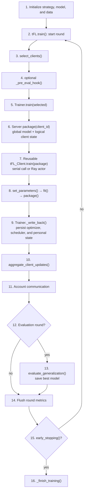

# Usage

## Quick Start

```bash
python main.py --dataset Electricity --strategy FedAvg --model Linear \
    --input_len 96 --output_len 720 --iterations 100
```

Load defaults from a JSON config file (CLI flags override):

```bash
python main.py --config_file configs/my_experiment.json --iterations 200
```

## Strategy Base Flow

Every strategy inherits or specializes this `tFL` round. The server owns logical
client state, while serial and Ray execution share the same package boundary.
Common options are mapped to the numbered steps below; strategy-specific options
apply inside the step overridden by that strategy.



| Steps | Options | Effect |
|-------|---------|--------|
| 1 | `--config_file`, `--seed`, `--times`, `--prev`, `--dataset`, `--model`, `--strategy`, `--input_len`, `--offset_len`, `--output_len`, `--scaler`, `--train_ratio` | Build the run, data, model, and strategy. |
| 1, 3 | `--exclude_ratio` | Mark held-out clients, then exclude them from round selection. |
| 2 | `--iterations` | Set the maximum number of federation rounds. |
| 3 | `--join_ratio`, `--random_join_ratio` | Choose how many incumbent clients participate. |
| 5, 7 | `--num_workers`, `--device`, `--device_id` | Select serial/Ray execution and worker devices. |
| 8 | `--sample_ratio`, `--batch_size`, `--epochs`, `--optimizer`, `--learning_rate`, `--loss`, `--scheduler`, `--scheduler_mode` | Configure local loading and optimization. |
| 8, 10 | `--return_diff` | Change the client upload and matching aggregation contract. |
| 8, 13 | `--efficiency` | Control model device residency during training and evaluation. |
| 12 | `--eval_gap` | Choose which rounds evaluate. |
| 13 | `--skip_eval_train`, `--exclude_server_model_processes` | Skip selected server-side evaluation work. |
| 15 | `--patience` | Stop after the configured non-improving evaluation window. |
| 1, 16 | `--project`, `--name`, `--sep` | Resolve output paths, then save final artifacts. |
| After 16 | `--compact` | Compact completed run outputs. |
| Interrupted run | `--keep_useless_run` | Keep partial output after `KeyboardInterrupt`. |

---

## Reference

### General

| Flag | Type | Default | Description |
|------|------|---------|-------------|
| `--config_file` | str | `None` | JSON config file; CLI flags override |
| `--seed` | int | `941` | Random seed |
| `--times` | int | `1` | Number of independent runs |
| `--prev` | int | `0` | Resume offset (skip first N runs) |
| `--num_workers` | int | `4` | Parallel workers |
| `--device` | str | `cuda` | `cpu` or `cuda` |
| `--device_id` | str | `0` | CUDA device id(s), comma-separated |
| `--efficiency` | str | `high` | Device residency — `low` / `med` / `high` |
| `--save_local_model` | flag | `False` | Save each client's local model checkpoint |
| `--keep_useless_run` | flag | `False` | Keep runs interrupted by `KeyboardInterrupt` |
| `--compact` | flag | `False` | Merge per-seed files and remove intermediates after a successful run |

### Save Path

| Flag | Type | Default | Description |
|------|------|---------|-------------|
| `--project` | str | `./runs` | Root output directory |
| `--name` | str | `exp` | Experiment name (auto-incremented if exists) |
| `--sep` | str | `""` | Separator for auto-increment suffix |

### Dataset

| Flag | Type | Default | Description |
|------|------|---------|-------------|
| `--dataset` | str | `ETDatasetHour` | Dataset name — see `docs/datasets.md` |
| `--input_len` | int | `96` | Lookback window length |
| `--offset_len` | int | `0` | Gap between input and output windows |
| `--output_len` | int | `96` | Forecast horizon |
| `--batch_size` | int | `32` | Batch size |
| `--scaler` | str | `Standard` | Normalisation — `BaseScaler` / `MaxAbs` / `MinMax` / `Robust` / `Standard` |
| `--train_ratio` | float | `0.8` | Fraction of each client's data used for training |
| `--sample_ratio` | float | `1.0` | Random subsample ratio applied to each client's train set |

### Federation

| Flag | Type | Default | Description |
|------|------|---------|-------------|
| `--strategy` | str | `LocalOnly` | FL strategy — see `docs/strategies.md` |
| `--model` | str | `DLinear` | Model architecture — see `docs/models.md` |
| `--iterations` | int | `10` | Global federation rounds |
| `--patience` | int | `0` | Early-stopping patience; `0` = disabled |
| `--join_ratio` | float | `1.0` | Fraction of clients selected per round |
| `--random_join_ratio` | bool | `False` | Randomly vary join ratio each round |
| `--eval_gap` | int | `1` | Evaluate every N rounds |
| `--skip_eval_train` | flag | `False` | Skip train-set evaluation each round |
| `--exclude_server_model_processes` | flag | `False` | Disable server-side model saving and summarisation |
| `--return_diff` | bool | `False` | Clients send weight delta instead of full model |

### Client

| Flag | Type | Default | Description |
|------|------|---------|-------------|
| `--optimizer` | str | `Adam` | Optimizer — see `docs/optimizers.md` |
| `--learning_rate` | float | `0.0001` | Local learning rate |
| `--epochs` | int | `1` | Local update steps per round |
| `--loss` | str | `MSE` | Loss function — see `docs/losses.md` |
| `--scheduler` | str | `BaseScheduler` | LR scheduler — see `docs/schedulers.md` |
| `--scheduler_mode` | str | `iteration` | Scheduler lifecycle — `batch` / `epoch` / `iteration` |

### Adversarial Eval

Applies only to `sFL`-based strategies. In benign mode (defaults) the behaviour is identical to a standard tFL run.

| Flag | Type | Default | Description |
|------|------|---------|-------------|
| `--attack` | str | `NoAttack` | Attack injected into malicious clients' packages each round |
| `--malicious_frac` | float | `0.0` | Fraction of clients designated as Byzantine; `0` = benign mode |

**Krum-specific**

| Flag | Type | Default | Description |
|------|------|---------|-------------|
| `--num_malicious_clients` | int | `0` | Per-round Byzantine upper bound f; `0` = derive the exact simulated malicious count among this round's clients |
| `--num_clients_to_keep` | int | `0` | Multi-Krum m in `[1, n]`; `0` = classical Krum |

**FedTrimmedAvg-specific**

| Flag | Type | Default | Description |
|------|------|---------|-------------|
| `--beta` | float | `0.2` | Fraction trimmed from each tail per coordinate |

Krum requires `2 * f + 2 < n` for the `n` clients participating in a round. FedTrimmedAvg requires `0 <= beta < 0.5`.

```bash
# Krum under Sign-Flip attack, 20% Byzantine clients
python main.py --dataset Electricity --strategy Krum --model DLinear \
    --attack SignFlip --malicious_frac 0.2 --iterations 100
```

### New-Client Onboarding

Holds out a fraction of clients from training. After federation ends, each held-out client runs a local adaptation step and is evaluated separately. Results are logged to the server log and saved to `new_client_results.json` in the run directory.

| Flag | Type | Default | Description |
|------|------|---------|-------------|
| `--exclude_ratio` | float | `0.0` | Fraction of clients held out; sampled randomly with `--seed` |
| `--adapt_T` | int | `None` | First T training windows for new clients; `None` = full train set |
| `--adapt_epochs` | int | `1` | Local adaptation epochs for new clients |

Strategies override `client.adapt()` for custom adaptation logic. The default fine-tunes from the global model with gradient descent. Strategies with no global model (e.g. `LocalOLS`) override to run their closed-form solve on the T windows instead.

```bash
# 20% new clients, each adapted on their first 100 windows
python main.py --dataset Electricity --strategy FedAvg --model Linear \
    --exclude_ratio 0.2 --adapt_T 100 --adapt_epochs 5
```
